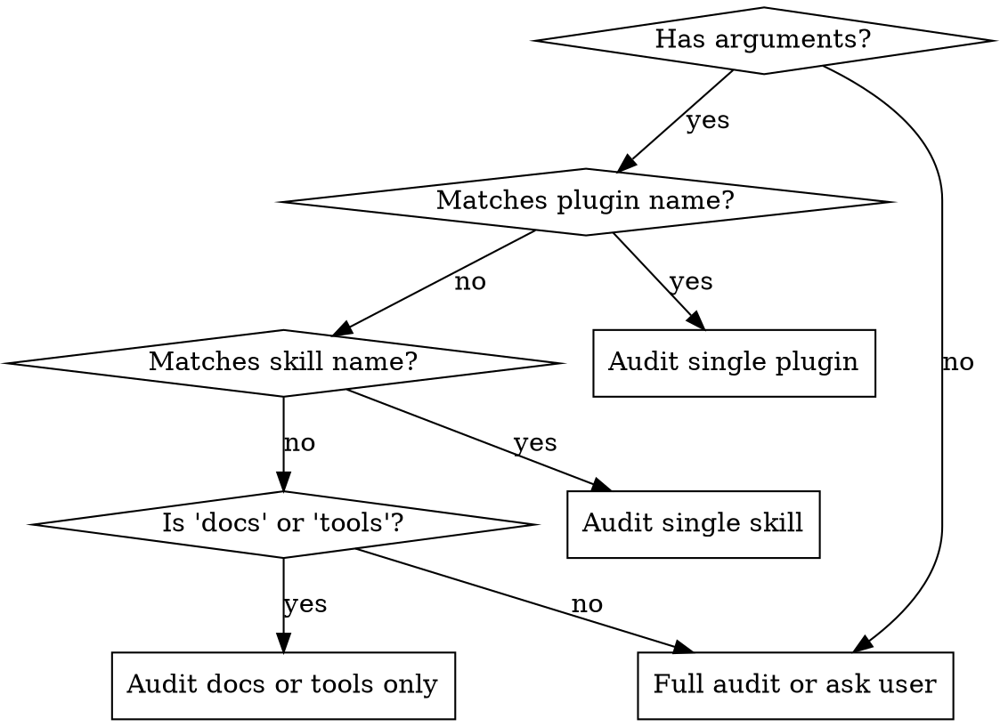

# Improve Skills and Tools

Announce: "I'm using the improve skill to audit and improve skills, tools, and documentation in this repo."

## Step 1: Scope and Route

Confirm this is the code-factory repo:

```bash
git rev-parse --show-toplevel
```

**If not code-factory:** inform the user and stop.

Determine scope from `$ARGUMENTS`:



Discover repo assets (run in parallel):

- `Glob("**/skills/*/SKILL.md")` — all skills
- `Glob("**/.claude-plugin/plugin.json")` — plugin manifests
- `Glob("**/agents/*.md")` — agent definitions
- `git log --oneline -20` — recent changes for context

Read each plugin's `plugin.json` to note current versions (needed for version bumps).

**If no arguments and no recent skill changes:** ask the user what area to focus on.

## Step 2: Evaluate

For each skill in scope, read it and evaluate against these dimensions:

| Dimension | What to look for |
|-----------|-----------------|
| **Friction** | Vague verbs ("handle", "process") without specific actions. Steps that assume unstated context. |
| **Token waste** | Paragraphs that should be tables. Content Claude already knows. Filler words: simply, just, easily, basically, actually, really, very. |
| **Missing pieces** | Error cases not covered. Edge cases unhandled. Missing cross-references. |
| **Inconsistency** | Missing announce line, unnumbered steps, no error handling section. Conventions from `AGENTS.md` not followed. |

Run a filler word scan on each file in scope:

```
Grep(pattern="\\b(simply|just|easily|basically|actually|really|very|obviously|clearly|of course|in order to|please note)\\b", path="<file>", output_mode="content")
```

Also apply criteria from [references/skill-quality-checklist.md](references/skill-quality-checklist.md) — conciseness (25%), scannability (25%), completeness (25%), consistency (15%), self-containment (10%).

Record each finding as: `file | dimension | one-sentence description`.

## Step 3: Fix

Apply changes directly. Prioritize:

1. **Critical**: broken cross-references, missing error handling, incorrect instructions
2. **Functional**: vague instructions, missing edge cases, inconsistent patterns
3. **Polish**: filler word removal, table formatting, redundant content

### Skills

For each skill change:

1. Replace vague verbs with specific commands or actions.
2. Convert paragraphs to tables where content is reference-like.
3. Remove filler words found in Step 2.
4. Verify announce line, numbered steps, error handling section.
5. Verify description starts with "Use when".
6. Check cross-references resolve: `make check-refs`.

### Documentation

**Files:** `AGENTS.md`, `README.md`, skill `SKILL.md` files

- Replace descriptions of actions with the actual commands.
- Remove ambiguous instructions discovered in Step 2.

### Tools

**Files:** `Makefile`, `init.sh`, config files

- Minimal output on success, clear messages on failure.
- Add missing validation targets if gaps found.

### New Skills

If a skill should exist but doesn't, read [references/new-skill-template.md](references/new-skill-template.md) for creation checklists and YAML templates. For significant new features, suggest `/execplan` instead.

**Version bump required:** Any skill or agent change requires a patch bump in the owning plugin's `.claude-plugin/plugin.json`. New skills require a minor bump.

## Step 4: Validate

```bash
make all
```

If `make all` fails:

1. Read the error output — identify which check failed.
2. Fix that specific issue.
3. Re-run `make all`.
4. Maximum 3 iterations. If still failing, report remaining errors to the user.

After `make all` passes, verify manually:

| Check | Command or action |
|-------|------------------|
| No filler words | `Grep(pattern="\\b(simply\|just\|easily\|basically)\\b", path="<changed files>")` |
| First-read clarity | Re-read each updated skill as a newcomer — every step unambiguous? |
| Description convention | All descriptions start with "Use when" |
| Naming conventions | New files follow `{plugin}/skills/{name}/SKILL.md` |

## Step 5: Report

Present a summary using the template in [references/report-template.md](references/report-template.md). For non-trivial improvements, include a brief before/after snippet. Omit sections with no entries.

## Error Handling

| Error | Action |
|-------|--------|
| Not in code-factory repo | Inform user this skill targets the code-factory plugin marketplace. Stop. |
| No recent changes and no focus area | Ask user what area to improve, or offer a general audit. |
| `make all` fails after 3 attempts | Report remaining failures with specific error output. |
| Multiple plugins need version bumps | Bump each independently. Run `make check-versions` to verify. |
| Broken cross-reference | If the target skill should exist, create it (see [references/new-skill-template.md](references/new-skill-template.md)). Otherwise fix the reference. |
| Significant interface change | Describe the proposed change and ask the user before applying. |
| Reference file missing | Proceed with inline principles: concise, scannable, complete, consistent, self-contained. |
