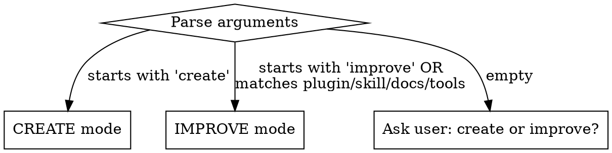

# Skill Workbench

Announce: "I'm using the skill workbench to work on skills in this plugin marketplace."

## Reference Documents

This skill has reference documents for deeper guidance. Load them when needed — not upfront.

| Reference | When to load |
|-----------|-------------|
| [best-practices.md](references/best-practices.md) | Writing or evaluating any skill content |
| [claude-search-optimization.md](references/claude-search-optimization.md) | Writing or improving descriptions and frontmatter |
| [persuasion-principles.md](references/persuasion-principles.md) | Writing discipline-enforcing skills that resist rationalization |
| [testing-with-subagents.md](references/testing-with-subagents.md) | Testing skill compliance with RED-GREEN-REFACTOR cycle |
| [progressive-disclosure.md](references/progressive-disclosure.md) | Deciding file organization and token optimization |
| [skill-quality-checklist.md](references/skill-quality-checklist.md) | Final quality gate before committing |
| [new-skill-template.md](references/new-skill-template.md) | Creating a new skill from scratch |
| [report-template.md](references/report-template.md) | Writing the Step 5 summary report |

## Step 1: Scope and Route

Confirm this is the code-factory repo:

```bash
git rev-parse --show-toplevel
```

**If not code-factory:** inform the user and stop.

Parse `$ARGUMENTS` to determine the operation mode:



Discover repo assets (run in parallel):

- `Glob("**/skills/*/SKILL.md")` — all skills
- `Glob("**/.claude-plugin/plugin.json")` — plugin manifests
- `Glob("**/agents/*.md")` — agent definitions
- `git log --oneline -20` — recent changes for context

Read each plugin's `plugin.json` to note current versions (needed for version bumps).

**If no arguments:** ask the user whether they want to create a new skill or improve existing ones.

Route to the appropriate mode:
- **CREATE mode** → Step 2
- **IMPROVE mode** → Step 3

---

## Step 2: Create a New Skill

### 2a: Gather Requirements

Determine from arguments and conversation:

| Requirement | How to resolve |
|-------------|---------------|
| **Skill name** | From `$ARGUMENTS` after "create". Must be kebab-case, max 64 chars. |
| **Owning plugin** | Ask user if ambiguous: `productivity`, `git`, or `code`. |
| **Purpose** | What problem does this skill solve? What triggers should invoke it? |
| **Skill type** | Discipline-enforcing, workflow automation, reference, or pattern? |
| **User-invocable?** | Should it appear in the `/` menu? Default: `true`. |
| **Model-invocable?** | Should Claude auto-invoke it? Default: `false` for task skills, `true` for reference skills. |

If the user's request is vague, ask clarifying questions before proceeding. For significant new features, suggest `/execplan` instead.

### 2b: Research

Before writing, gather context:

1. **Read similar skills** in the repo to match conventions and quality bar.
2. **Search the web** if the skill covers an unfamiliar domain (use WebSearch/WebFetch).
3. **Read [best-practices.md](references/best-practices.md)** for authoring principles: conciseness, degrees of freedom, token optimization.
4. **Read [claude-search-optimization.md](references/claude-search-optimization.md)** for writing discoverable descriptions and choosing keywords.
5. **For discipline-enforcing skills:** read [persuasion-principles.md](references/persuasion-principles.md) for authority, commitment, and rationalization-resistance techniques.

### 2c: Write the Skill

Create directory and SKILL.md:

```bash
mkdir -p {plugin}/skills/{name}
```

Write `{plugin}/skills/{name}/SKILL.md` using the template from [new-skill-template.md](references/new-skill-template.md).

**SKILL.md body rules:**

| Rule | Detail |
|------|--------|
| Announce line | First line after heading: `Announce: "I'm using the {name} skill to {purpose}."` |
| Numbered steps | `## Step N: Title` sections with specific actions and commands |
| Error handling | Final `## Error Handling` section as a table of failure modes and resolutions |
| Description = triggers only | Description says WHEN to use the skill, never summarizes the workflow |
| Concise | One sentence per concept. Tables over paragraphs. No filler words. |
| Specific commands | `Run make all` not "validate your changes" |
| Under 500 lines | Move heavy reference material to separate files in the skill directory |
| Self-contained | Works without external context. Duplication preferred over external dependencies. |
| Degrees of freedom | Low-freedom for fragile ops (exact commands), high-freedom for judgment calls. See [progressive-disclosure.md](references/progressive-disclosure.md). |

**Supporting files** (optional): create in `references/` or `scripts/` subdirectories for templates, examples, or reference docs. Keep references one level deep from SKILL.md. Reference them explicitly so Claude knows when to load them.

**For discipline-enforcing skills**, apply techniques from [persuasion-principles.md](references/persuasion-principles.md):

- Use bright-line rules with authority language ("NEVER", "YOU MUST")
- Add rationalization tables countering specific excuses
- Include red flag lists for self-checking
- Close loopholes explicitly ("Delete means delete. Not 'save for reference.'")

### 2d: Test the Skill (Discipline-Enforcing Skills)

For skills that enforce rules or resist agent rationalization, follow the RED-GREEN-REFACTOR cycle from [testing-with-subagents.md](references/testing-with-subagents.md):

1. **RED**: Launch a Task subagent with a pressure scenario (3+ combined pressures) WITHOUT the skill. Document baseline rationalizations verbatim.
2. **GREEN**: Load the skill and re-run the same scenario. Verify compliance.
3. **REFACTOR**: If the agent found loopholes, add explicit counters and re-test.

For workflow or reference skills, functional testing during Step 2e validation is sufficient.

### 2e: Create OpenCode Command

Create `.opencode/commands/{name}.md` to mirror the skill for OpenCode:

```yaml
---
description: >
  Use when {same triggers as SKILL.md description}.
---

Invoke the `{name}` skill with explicit syntax:

skill({ name: "{name}" })
```

### 2f: Validate and Version Bump

1. Bump the owning plugin's version in `.claude-plugin/plugin.json` (minor bump for new skills).
2. Run `make all` to validate frontmatter, cross-references, structure, and JSON.
3. Fix any failures (max 3 iterations).
4. Run the quality gate from [skill-quality-checklist.md](references/skill-quality-checklist.md).
5. Update `README.md` to include the new skill in the Quick Reference table and plugin description.

Route to Step 5 (Report).

---

## Step 3: Improve Existing Skills

### 3a: Determine Scope

From `$ARGUMENTS`, identify the target:

| Argument | Scope |
|----------|-------|
| Plugin name (`productivity`, `git`, `code`) | All skills in that plugin |
| Skill name (`commit`, `pr`, `do`) | That single skill |
| `docs` | `AGENTS.md`, `README.md`, skill `SKILL.md` files |
| `tools` | `Makefile`, `init.sh`, config files |
| No argument | Ask user, or audit skills changed in recent commits |

### 3b: Evaluate

Read [best-practices.md](references/best-practices.md) and [skill-quality-checklist.md](references/skill-quality-checklist.md) before evaluating.

For each skill in scope, read it and evaluate against these dimensions:

| Dimension | What to look for |
|-----------|-----------------|
| **Friction** | Vague verbs ("handle", "process") without specific actions. Steps that assume unstated context. |
| **Token waste** | Paragraphs that should be tables. Content Claude already knows. Filler words. SKILL.md over 500 lines. |
| **Missing pieces** | Error cases not covered. Edge cases unhandled. Missing cross-references. |
| **Inconsistency** | Missing announce line, unnumbered steps, no error handling section. |
| **Description quality** | Workflow summary in description (should be triggers only). Missing trigger phrases. See [claude-search-optimization.md](references/claude-search-optimization.md). |
| **File organization** | All content inline when reference files would save tokens. Nested references deeper than one level. See [progressive-disclosure.md](references/progressive-disclosure.md). |

Run a filler word scan on each file in scope:

```
Grep(pattern="\\b(simply|just|easily|basically|actually|really|very|obviously|clearly|of course|in order to|please note)\\b", path="<file>", output_mode="content")
```

Record each finding as: `file | dimension | one-sentence description`.

### 3c: Fix

Apply changes directly. Prioritize:

1. **Critical**: broken cross-references, missing error handling, incorrect instructions
2. **Functional**: vague instructions, missing edge cases, inconsistent patterns, description quality
3. **Polish**: filler word removal, table formatting, redundant content, token optimization

**For skills:**

1. Replace vague verbs with specific commands or actions.
2. Convert paragraphs to tables where content is reference-like.
3. Remove filler words found in Step 3b.
4. Verify announce line, numbered steps, error handling section.
5. Verify description starts with "Use when" and contains no workflow summary.
6. Check cross-references resolve: `make check-refs`.
7. Verify SKILL.md body is under 500 lines — extract heavy reference to separate files if needed.
8. For discipline-enforcing skills: verify rationalization tables, red flag lists, and bright-line rules are present (see [persuasion-principles.md](references/persuasion-principles.md)).

**For documentation** (`AGENTS.md`, `README.md`, skill `SKILL.md` files):

- Replace descriptions of actions with specific commands.
- Remove ambiguous instructions discovered in Step 3b.

**For tools** (`Makefile`, `init.sh`, config files):

- Minimal output on success, clear messages on failure.
- Add missing validation targets if gaps found.

**Version bump required:** Any skill or agent change requires a patch bump in the owning plugin's `.claude-plugin/plugin.json`. New skills require a minor bump.

## Step 4: Validate

```bash
make all
```

If `make all` fails:

1. Read the error output — identify which check failed.
2. Fix that specific issue.
3. Re-run `make all`.
4. Maximum 3 iterations. If still failing, report remaining errors to the user.

After `make all` passes, verify manually:

| Check | Command or action |
|-------|------------------|
| No filler words | `Grep(pattern="\\b(simply\|just\|easily\|basically)\\b", path="<changed files>")` |
| First-read clarity | Re-read each updated skill as a newcomer — every step unambiguous? |
| Description convention | All descriptions start with "Use when", no workflow summaries |
| Naming conventions | New files follow `{plugin}/skills/{name}/SKILL.md` |
| Token efficiency | SKILL.md body under 500 lines. Heavy reference in separate files. |
| Quality gate | Apply [skill-quality-checklist.md](references/skill-quality-checklist.md) |

## Step 5: Report

Present a summary using the template in [references/report-template.md](references/report-template.md). For non-trivial improvements, include a brief before/after snippet. Omit sections with no entries.

## Error Handling

| Error | Action |
|-------|--------|
| Not in code-factory repo | Inform user this skill targets the code-factory plugin marketplace. Stop. |
| No arguments and no recent skill changes | Ask user: create a new skill or improve existing ones? |
| `make all` fails after 3 attempts | Report remaining failures with specific error output. |
| Multiple plugins need version bumps | Bump each independently. Run `make check-versions` to verify. |
| Broken cross-reference | If the target skill should exist, create it. Otherwise fix the reference. |
| Significant interface change | Describe the proposed change and ask the user before applying. |
| Skill name conflicts with existing | Inform the user and suggest an alternative name. |
| Reference file missing | Proceed with inline principles: concise, scannable, complete, consistent, self-contained. |
